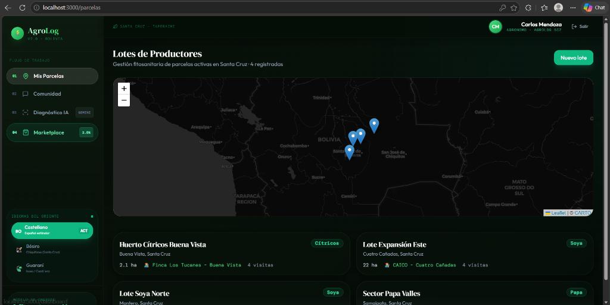

# 🌾 AgroLog (Powered by EnerCruz Ecosistema)

> **Ecosistema de Inteligencia Agrícola, Diagnóstico Foliar con IA Multimodal y Marketplace de Adquisición Tecnológica para Santa Cruz, Bolivia.**

---

## 👥 Equipo y Colaboradores
* **Nombre del Equipo**: **EnerCruz Tech**
* **Integrantes**:
  * **Amira Raciel Ramos Fuentes** (Desarrolladora Frontend & Diseño UX/UI)
  * **Victor Hugo Murillo Siles** (Desarrollador Full Stack & Integración de Base de Datos)
  * **Mijael Mérida Alvarado** (Desarrollador Backend & Modelado de Negocio)
  * **Dax Kenji Tellez Duran** (Desarrollador General & Integración de APIs)
  * **Ronald Augusto Rodriguez Serrano** (Pitch & Comunicación Social)

---

## 💡 Explicación General de AgroLog & EnerCruz

En el departamento de Santa Cruz, Bolivia, la agricultura a gran escala se enfrenta constantemente a plagas devastadoras (como la *Roya Asiática de la Soya* y el *Gusano Cogollero*) que diezman los cultivos. **AgroLog (EnerCruz)** nace como un ecosistema tecnológico de tercera generación que unifica a **Productores/Agrónomos** en el campo y a **Administradores Centrales** en las cooperativas para tomar decisiones fitosanitarias colectivas y eficientes:

1. **Monitoreo en Tiempo Real**: Agrónomos en el campo registran parcelas, toman diagnósticos visuales y envían reportes de plagas con fotografías reales al **Canal de Difusión Regional**.
2. **Diagnóstico Multimodal de IA (Gemini Vision)**: El Administrador Central revisa el feed y, con un solo clic, invoca a **Gemini 1.5 Flash** para escanear los píxeles reales de las plantas, emitir veredictos técnicos automáticos y generar propuestas fitosanitarias oficiales.
3. **Monetización & Marketplace**: Basado en las alertas de la IA, el **Marketplace** de AgroLog sugiere en tiempo real los insumos precisos y los despachos locales (Mainter, CAICO, Interagro). AgroLog monetiza mediante un **modelo de mediación del 3.5% por transacción**, impulsando compras masivas desde cooperativas mediante **Informes PDF Consolidados**.
4. **Seguridad contra Spam**: Integra un filtro de spam inteligente de IA que detecta y bloquea fotos no agrícolas (selfies, comida, bromas) para mantener la seriedad productiva del canal.

---

## 📸 Capturas de la Interfaz Premium

### Panel de Control de Lotes y Mapas Regionales


---

## 🛠️ Arquitectura del Sistema & Tecnologías

AgroLog (EnerCruz) está construido sobre una arquitectura moderna, rápida y ultraestable diseñada para el entorno del agro:

```mermaid
graph TD
    A[Next.js 14 App Router - Frontend Premium] -->|API Requests| B[Next.js Server Actions & Route Handlers]
    B -->|Prisma Client| C[Base de Datos PostgreSQL / SQLite]
    B -->|Multimodal Image Analysis| D[Google Gemini 1.5 Flash API]
    B -->|Auth & Role Check| E[NextAuth.js v5 - Credenciales Sandbox]
    B -->|Reportes Imprimibles| F[@react-pdf / HTML Print Layout]
```

### Tecnologías Clave:
* **Frontend**: Next.js 14 (App Router) con diseño ultra premium *Dark Glassmorphism*, micro-animaciones en Framer Motion y GSAP para deleitar a los jueces en el Pitch.
* **Base de Datos**: Prisma ORM conectado a SQLite local (para desarrollo ágil offline) y PostgreSQL en Neon (producción).
* **Inteligencia Artificial**: Google Generative AI SDK (`gemini-1.5-flash-latest`) para análisis visual multimodal fitopatológico y filtrado de contenido spam.
* **Internacionalización**: Localización nativa bilingüe al **Español**, **Bésiro (Chiquitano)** y **Guaraní**, integrando a las comunidades originarias de Santa Cruz.

---

## ⚙️ Instrucciones Paso a Paso para la Ejecución del Código

Sigue estos pasos para instalar y ejecutar el proyecto localmente de manera impecable:

### 1. Clonar el repositorio e Instalar dependencias
```bash
# Clonar el proyecto
git clone https://github.com/jackson1939/AGROLOG.git
cd AGROLOG

# Instalar dependencias node
npm install
```

### 2. Configurar Variables de Entorno (`.env.local`)
Crea un archivo llamado **`.env.local`** en la carpeta raíz del proyecto y añade las siguientes credenciales esenciales:

```env
# Conexión a Base de Datos (Neon PostgreSQL para producción, o SQLite para offline)
DATABASE_URL="file:./dev.db"

# Autenticación NextAuth.js
NEXTAUTH_SECRET="agrolog-dev-secret-change-in-production-2024"
NEXTAUTH_URL="http://localhost:3000"
AUTH_SECRET="agrolog-dev-secret-change-in-production-2024"

# Clave de API de Google Gemini (Obtenla gratis en Google AI Studio)
GEMINI_API_KEY="Tu_Clave_Real_Aqui_Comenzando_Con_AIzaSy"

# Aplicación
NEXT_PUBLIC_APP_URL="http://localhost:3000"
```

### 3. Preparar la Base de Datos y Sembrar los Datos de Demostración (Seed)
Ejecuta las migraciones y llena la base de datos con las cuentas demo pre-configuradas para tu presentación:

```bash
# Sincronizar el esquema de Prisma con la base de datos local
npx prisma db push

# Ejecutar el sembrado de datos (crea parcelas, visitas y cuentas demo)
npx prisma db seed
```

### 4. Lanzar el Servidor de Desarrollo
```bash
npm run dev
```
Abre tu navegador en [http://localhost:3000](http://localhost:3000).

---

## 🔐 Credenciales de Prueba para la Demo en Vivo

En la pantalla de Login, puedes hacer **clic directo** sobre las tarjetas de demostración para autocompletar e ingresar de forma instantánea:

* **👨‍🌾 Agrónomo / Productor**:
  * **Email**: `demo@agrolog.bo`
  * **Contraseña**: `campo2024`
* **👑 Administrador Central**:
  * **Email**: `admin@agrolog.bo`
  * **Contraseña**: `admin2024`
