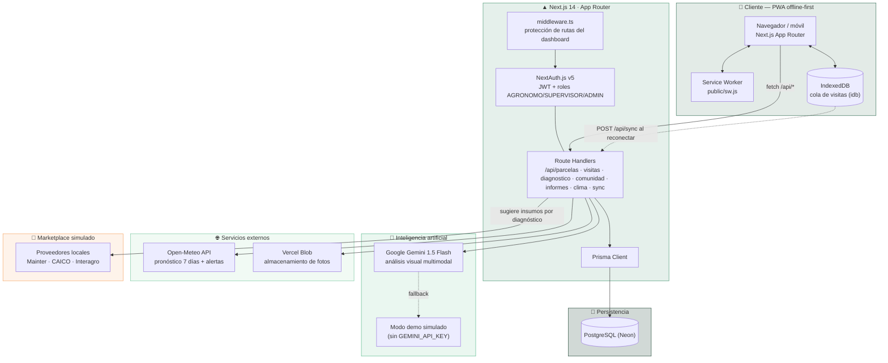
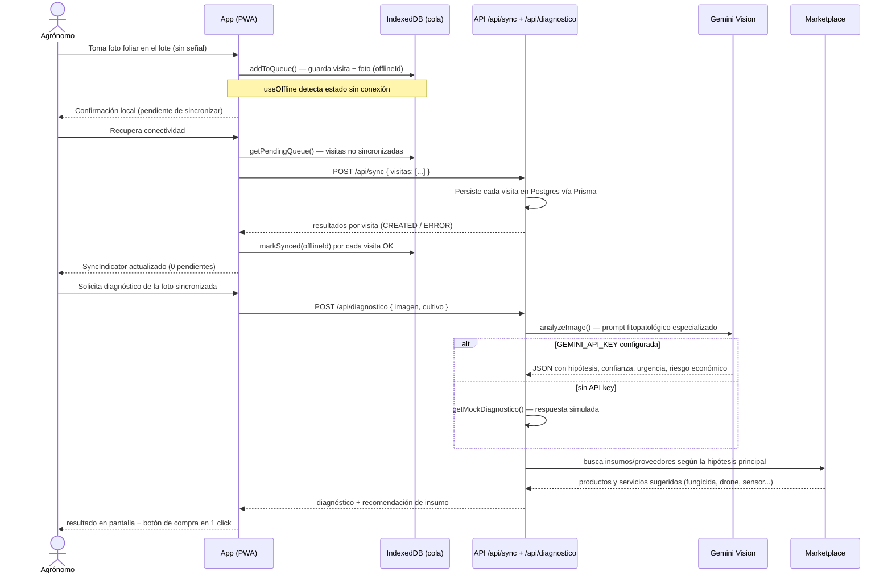
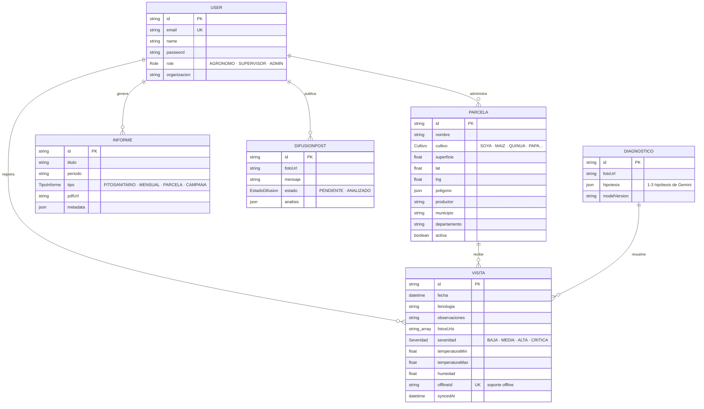
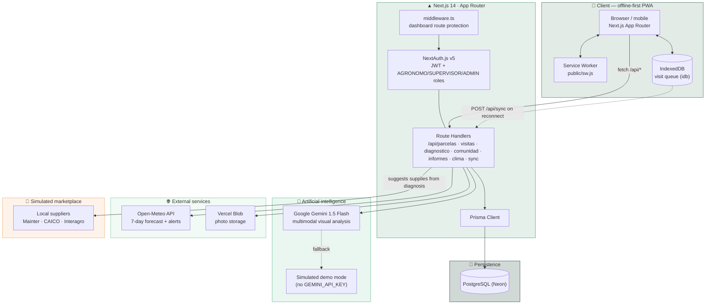
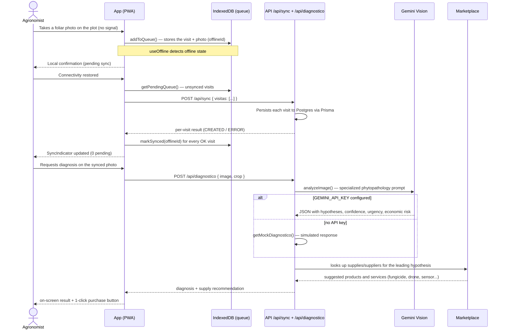
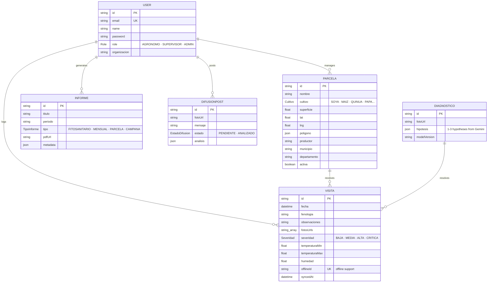

  

  

  
  
  
  
  

  
  
  
  

  

  <a href="#español"><b>🇪🇸 Español</b></a> &nbsp;·&nbsp; <a href="#english"><b>🇬🇧 English</b></a>

---

## 🇪🇸 Español

### 📑 Tabla de contenidos

- [¿Qué es AgroLog?](#qué-es-agrolog)
- [Arquitectura](#arquitectura)
- [Flujo de diagnóstico offline-first](#flujo-de-diagnóstico-offline-first)
- [Modelo de datos](#modelo-de-datos)
- [Características principales](#características-principales)
- [Stack tecnológico](#stack-tecnológico)
- [Estructura del proyecto](#estructura-del-proyecto)
- [Estado del proyecto y roadmap](#estado-del-proyecto-y-roadmap)
- [Licencia](#licencia)
- [Autor](#autor)

---

### ¿Qué es AgroLog?

**AgroLog** (referido también en el código como parte del "ecosistema EnerCruz") es una aplicación web pensada para agrónomos, productores y cooperativas agrícolas del departamento de **Santa Cruz, Bolivia**. Nació como proyecto de hackathon/pitch — el repositorio incluye un `business_model.md` redactado explícitamente para un jurado, que documenta el pivot estratégico desde una idea original de Smart Grid energético (CRE) hacia el enfoque agrícola actual — y ataca un problema muy concreto del agro cruceño: los técnicos de campo necesitan **registrar visitas a parcelas, diagnosticar plagas y enfermedades foliares, y conectar ese diagnóstico con la compra del insumo correcto**, casi siempre **sin conectividad estable** en zonas rurales.

La plataforma unifica tres roles de trabajo que interactúan sobre el mismo dato:

| Rol | Qué hace |
|---|---|
| 🌱 **Agrónomo / Productor** | Registra parcelas, lleva la bitácora de visitas de campo (fotos, fenología, severidad, clima) y solicita diagnósticos por IA — incluso sin señal. |
| 🛡️ **Administrador / Supervisor** | Revisa el canal de "comunidad" (reportes fotográficos enviados por productores) y dispara el análisis de IA sobre ellos. |
| 🏪 **Proveedor local** (Mainter, CAICO, Interagro, etc.) | Aparece sugerido automáticamente en el marketplace cuando la IA detecta una plaga o deficiencia específica en una parcela. |

> **Nota de madurez del proyecto**: por el contenido de `business_model.md` y por el propio código (datos de demostración, modelo simulado cuando falta la API key de Gemini, credenciales de ejemplo sembradas por `prisma/seed.ts`), este es un **MVP/prototipo de hackathon**, no un sistema en producción con datos reales de clientes ni pagos reales. El marketplace es un flujo transaccional **simulado**: ilustra el modelo de negocio (comisión del 3–5% documentada en `business_model.md`), pero no procesa cobros reales todavía.

La idea central del pitch, tal como está planteada en `business_model.md`, es que AgroLog no es "solo una app para registrar visitas": actúa como **mediador comercial** entre la tecnología de punta (IA de diagnóstico, drones, sensores de suelo) y el productor de campo, cerrando el círculo entre *"detecté un problema"* y *"ya compré la solución"* en la misma sesión.

### Arquitectura

AgroLog es una aplicación **Next.js 14 (App Router)** full-stack: el mismo proyecto sirve el frontend React, expone los Route Handlers como API interna, habla con Prisma/PostgreSQL, y actúa como PWA offline-first en el navegador del agrónomo. Alrededor de ese núcleo hay tres integraciones externas (Gemini Vision, Open-Meteo y Vercel Blob) y un marketplace simulado que reacciona a los resultados del diagnóstico.

```mermaid
graph TB
    subgraph Client["📱 Cliente — PWA offline-first"]
        Browser["Navegador / móvil<br/>Next.js App Router"]
        SW["Service Worker<br/>public/sw.js"]
        IDB[("IndexedDB<br/>cola de visitas (idb)")]
        Browser <--> SW
        Browser <--> IDB
    end

    subgraph Server["▲ Next.js 14 · App Router"]
        Auth["NextAuth.js v5<br/>JWT + roles AGRONOMO/SUPERVISOR/ADMIN"]
        Middleware["middleware.ts<br/>protección de rutas del dashboard"]
        API["Route Handlers<br/>/api/parcelas · visitas · diagnostico · comunidad · informes · clima · sync"]
        Prisma["Prisma Client"]
        Middleware --> Auth
        Auth --- API
        API --> Prisma
    end

    subgraph AI["🤖 Inteligencia artificial"]
        Gemini["Google Gemini 1.5 Flash<br/>análisis visual multimodal"]
        Mock["Modo demo simulado<br/>(sin GEMINI_API_KEY)"]
        Gemini -. fallback .-> Mock
    end

    subgraph External["🌐 Servicios externos"]
        Meteo["Open-Meteo API<br/>pronóstico 7 días + alertas"]
        Blob["Vercel Blob<br/>almacenamiento de fotos"]
    end

    subgraph Data["💾 Persistencia"]
        PG[("PostgreSQL (Neon)")]
    end

    subgraph Market["🛒 Marketplace simulado"]
        Providers["Proveedores locales<br/>Mainter · CAICO · Interagro"]
    end

    Browser -->|"fetch /api/*"| API
    IDB -.->|"POST /api/sync al reconectar"| API
    API --> Gemini
    API --> Meteo
    API --> Blob
    Prisma --> PG
    API -->|"sugiere insumos por diagnóstico"| Providers

    style Client fill:#2D6A4F22,stroke:#2D6A4F
    style Server fill:#40916C22,stroke:#40916C
    style AI fill:#95D5B233,stroke:#52B788
    style External fill:#B7E4C733,stroke:#74C69D
    style Data fill:#1B433233,stroke:#1B4332
    style Market fill:#F4A46122,stroke:#F4A461
```

> Todo el backend vive dentro del mismo proyecto Next.js como Route Handlers (no hay un servicio separado): `app/api/*` concentra la autenticación, el CRUD de parcelas/visitas, el endpoint de diagnóstico con Gemini, el proxy a Open-Meteo, la generación de informes y el endpoint de sincronización offline.

### Flujo de diagnóstico offline-first

Este es el recorrido real de un diagnóstico, desde que el agrónomo toma la foto en el lote sin señal hasta que recibe una recomendación de insumo del marketplace:

```mermaid
sequenceDiagram
    actor Agr as Agrónomo
    participant PWA as App (PWA)
    participant IDB as IndexedDB (cola)
    participant API as API /api/sync + /api/diagnostico
    participant Gemini as Gemini Vision
    participant Mkt as Marketplace

    Agr->>PWA: Toma foto foliar en el lote (sin señal)
    PWA->>IDB: addToQueue() — guarda visita + foto (offlineId)
    Note over PWA,IDB: useOffline detecta estado sin conexión
    PWA-->>Agr: Confirmación local (pendiente de sincronizar)

    Agr->>PWA: Recupera conectividad
    PWA->>IDB: getPendingQueue() — visitas no sincronizadas
    PWA->>API: POST /api/sync { visitas: [...] }
    API->>API: Persiste cada visita en Postgres vía Prisma
    API-->>PWA: resultados por visita (CREATED / ERROR)
    PWA->>IDB: markSynced(offlineId) por cada visita OK
    PWA-->>Agr: SyncIndicator actualizado (0 pendientes)

    Agr->>PWA: Solicita diagnóstico de la foto sincronizada
    PWA->>API: POST /api/diagnostico { imagen, cultivo }
    API->>Gemini: analyzeImage() — prompt fitopatológico especializado
    alt GEMINI_API_KEY configurada
        Gemini-->>API: JSON con hipótesis, confianza, urgencia, riesgo económico
    else sin API key
        API->>API: getMockDiagnostico() — respuesta simulada
    end
    API->>Mkt: busca insumos/proveedores según la hipótesis principal
    Mkt-->>API: productos y servicios sugeridos (fungicida, drone, sensor...)
    API-->>PWA: diagnóstico + recomendación de insumo
    PWA-->>Agr: resultado en pantalla + botón de compra en 1 click
```

### Modelo de datos

Definido en `prisma/schema.prisma` sobre **PostgreSQL**. El núcleo es la relación `User → Parcela → Visita`, con `Diagnostico` como resultado de IA reutilizable entre visitas, `Informe` para los PDF generados y `DifusionPost` para el canal comunitario:

```mermaid
erDiagram
    USER ||--o{ PARCELA : "administra"
    USER ||--o{ VISITA : "registra"
    USER ||--o{ INFORME : "genera"
    USER ||--o{ DIFUSIONPOST : "publica"
    PARCELA ||--o{ VISITA : "recibe"
    DIAGNOSTICO ||--o{ VISITA : "resuelve"

    USER {
        string id PK
        string email UK
        string name
        string password
        Role role "AGRONOMO · SUPERVISOR · ADMIN"
        string organizacion
    }
    PARCELA {
        string id PK
        string nombre
        Cultivo cultivo "SOYA · MAIZ · QUINUA · PAPA..."
        float superficie
        float lat
        float lng
        json poligono
        string productor
        string municipio
        string departamento
        boolean activa
    }
    VISITA {
        string id PK
        datetime fecha
        string fenologia
        string observaciones
        string_array fotosUrls
        Severidad severidad "BAJA · MEDIA · ALTA · CRITICA"
        float temperaturaMin
        float temperaturaMax
        float humedad
        string offlineId UK "soporte offline"
        datetime syncedAt
    }
    DIAGNOSTICO {
        string id PK
        string fotoUrl
        json hipotesis "1-3 hipótesis de Gemini"
        string modelVersion
    }
    INFORME {
        string id PK
        string titulo
        string periodo
        TipoInforme tipo "FITOSANITARIO · MENSUAL · PARCELA · CAMPANA"
        string pdfUrl
        json metadata
    }
    DIFUSIONPOST {
        string id PK
        string fotoUrl
        string mensaje
        EstadoDifusion estado "PENDIENTE · ANALIZADO"
        json analisis
    }
```

### Características principales

**🗺️ Bitácora de campo offline-first**
- Gestión de parcelas: alta, edición y listado con cultivo, superficie, productor, municipio/departamento y ubicación geográfica (lat/lng + polígono opcional), visualizadas en mapa interactivo con **Leaflet**.
- Registro de visitas por parcela: fecha, fenología, observaciones, severidad (`BAJA`/`MEDIA`/`ALTA`/`CRITICA`), fotos, temperatura mín/máx, humedad, producto aplicado, dosis y seguimiento.
- Captura de fotos in-situ con un componente de cámara propio (`useCamera`, `FotoCapture`) directamente desde el navegador/móvil.
- **Funcionamiento sin conexión real**: Service Worker (`public/sw.js`) con caché de rutas clave, cola de sincronización (`lib/offline/queue.ts`, `lib/offline/sync.ts`) y persistencia en **IndexedDB** (`idb`) para registrar visitas sin señal y sincronizarlas automáticamente al reconectar (`useOffline`, `SyncIndicator`).

**🔬 Diagnóstico foliar con IA multimodal**
- Integración con **Google Gemini** (`gemini-1.5-flash-latest`) vía `lib/gemini.ts`: envía una foto de campo y recibe hasta 3 hipótesis de diagnóstico (enfermedad, plaga, deficiencia, fisiológico o normal) con nivel de confianza, síntomas, acción recomendada, urgencia y riesgo económico estimado.
- Prompt especializado en fitopatología boliviana/latinoamericana, con salida forzada a JSON estructurado.
- **Modo demo automático**: si no hay `GEMINI_API_KEY` configurada, el sistema cae en una respuesta simulada (`getMockDiagnostico`) sin romper el flujo.
- Canal de comunidad/difusión: feed de reportes fotográficos que un administrador puede analizar con la misma IA para emitir un veredicto y una recomendación fitosanitaria.

**🌦️ Alertas climáticas automáticas**
- Integración con la API pública y gratuita **Open-Meteo** (`lib/clima.ts`), sin necesidad de API key.
- Pronóstico a 7 días por parcela, usando la lat/lng registrada.
- Cálculo automático de alertas de **helada** (temperatura mínima < 4 °C), **sequía** (sin precipitación en las próximas jornadas) y **viento fuerte** (> 40 km/h) directamente sobre la respuesta del servicio.

**🛒 Marketplace de insumos**
- A partir del diagnóstico, sugiere productos y servicios (fungicidas, herbicidas, fertilizantes, fumigación con drones, sensores IoT) de proveedores reales de Santa Cruz (Mainter, CAICO, Interagro, entre otros).
- Flujo simulado de "compra en 1 clic", pensado como demo del modelo de negocio de comisión (3–5% por transacción) descrito en `business_model.md`.
- Pensado también como canal de publicidad nativa: las marcas de insumos podrían pagar por aparecer priorizadas cuando la IA detecta una deficiencia o plaga específica.

**📄 Informes en PDF**
- Generación de reportes fitosanitarios, mensuales, por parcela o por campaña usando `@react-pdf/renderer`.
- Configuración y previsualización del informe antes de exportarlo.

**🔐 Autenticación, roles e internacionalización**
- Login con credenciales (email/contraseña) vía **NextAuth.js v5**, contraseñas con `bcryptjs`, sesiones JWT y roles `AGRONOMO`, `SUPERVISOR`, `ADMIN`; rutas del dashboard protegidas por `middleware.ts`.
- Selector de idioma nativo con soporte para **Español**, **Bésiro (Chiquitano)** y **Guaraní** (`lib/language.tsx`), pensado para comunidades originarias de Santa Cruz.

**📊 Dashboard y experiencia visual**
- Tarjetas de resumen (parcelas totales, visitas del mes, diagnósticos, informes), gráficos interactivos con **Recharts** y actividad reciente.
- UI con Tailwind CSS, componentes propios (`Button`, `Card`, `Modal`, `Toast`, `Badge`...), animaciones con **Framer Motion** y **GSAP**, y fondo interactivo animado en el layout del dashboard.

### Stack tecnológico

| Capa | Tecnología | Rol en AgroLog |
|---|---|---|
| ▲ Framework full-stack | **Next.js 14.2.18** (App Router, Route Handlers, Server Actions) | Frontend + API interna en un solo proyecto |
| 🎨 UI | **React 18.3** + **TypeScript 5** (`strict`) + **Tailwind CSS 3.4** | Interfaz tipada y estilada por utilidades |
| 🗄️ ORM / datos | **Prisma ORM 5.22** sobre **PostgreSQL** (pensado para Neon) | Acceso a datos y migraciones |
| 🔐 Autenticación | **NextAuth.js v5 (beta)** + `bcryptjs` | Login por credenciales, sesiones JWT, roles |
| ✅ Validación | **Zod 3** + `react-hook-form` + `@hookform/resolvers` | Esquemas y formularios |
| 🧠 Estado global | **Zustand 4** | Estado de sync, parcelas y visitas |
| 🤖 IA | **`@google/generative-ai`** (Gemini 1.5 Flash) | Diagnóstico foliar multimodal |
| 🗺️ Mapas | **Leaflet** + `react-leaflet` | Visualización geográfica de parcelas |
| 🌦️ Clima | API pública **Open-Meteo** | Pronóstico y alertas agroclimáticas |
| 📄 Reportes | **`@react-pdf/renderer`** | Generación de informes PDF |
| 📈 Gráficos | **Recharts** | Dashboard de estadísticas |
| 📴 Offline / PWA | Service Worker nativo + `idb` (IndexedDB) | Registro sin conexión y cola de sync |
| 🎬 Animación | **Framer Motion** + **GSAP** (`@gsap/react`) | Transiciones y microinteracciones |
| ☁️ Almacenamiento | **Vercel Blob** | Fotos subidas desde el campo |
| 🔔 UX | **Sonner** (toasts) + **Lucide React** (iconos) | Feedback visual |

### Estructura del proyecto

```mermaid
graph TD
    Root["agrolog/"] --> App["app/"]
    Root --> Comp["components/"]
    Root --> Hooks["hooks/"]
    Root --> Lib["lib/"]
    Root --> Store["store/"]
    Root --> Prisma["prisma/"]
    Root --> Types["types/"]
    Root --> Public["public/"]
    Root --> Mid["middleware.ts"]
    Root --> BizModel["business_model.md"]

    App --> AuthRoute["(auth)/login/<br/>ruta pública"]
    App --> Dash["(dashboard)/<br/>rutas protegidas"]
    Dash --> DDashboard["dashboard/ · resumen y stats"]
    Dash --> DParcelas["parcelas/ · CRUD + bitácora"]
    Dash --> DCampo["campo/ · registro de visitas"]
    Dash --> DDiag["diagnostico/ · upload + IA"]
    Dash --> DComu["comunidad/ · canal de reportes"]
    Dash --> DInf["informes/ · generación PDF"]
    App --> Api["api/ · Route Handlers"]
    Api --> ApiAuth["auth/[...nextauth]"]
    Api --> ApiParc["parcelas/"]
    Api --> ApiVis["visitas/"]
    Api --> ApiDiag["diagnostico/"]
    Api --> ApiComu["comunidad/"]
    Api --> ApiInf["informes/"]
    Api --> ApiClima["clima/ · proxy Open-Meteo"]
    Api --> ApiSync["sync/ · sincronización offline"]

    Comp --> CCampo["campo/ · cámara, formularios, timeline"]
    Comp --> CDash["dashboard/ · stats, gráficos, alertas"]
    Comp --> CDiag["diagnostico/ · uploader, marketplace"]
    Comp --> CInf["informes/ · config, preview, render"]
    Comp --> CParc["parcelas/ · cards, form, mapa"]
    Comp --> CLayout["layout/ · header, sidebar, idioma"]
    Comp --> CUi["ui/ · Button, Card, Modal, Toast"]

    Lib --> LAuth["auth.ts · config NextAuth"]
    Lib --> LGemini["gemini.ts · cliente Gemini Vision"]
    Lib --> LClima["clima.ts · integración Open-Meteo"]
    Lib --> LPrisma["prisma.ts · client singleton"]
    Lib --> LLang["language.tsx · i18n ES/Bésiro/Guaraní"]
    Lib --> LOffline["offline/ · db.ts, queue.ts, sync.ts"]
    Lib --> LPdf["pdf/ · generación de informes"]
    Lib --> LVal["validations/ · esquemas Zod"]

    Prisma --> Schema["schema.prisma · modelo de datos"]
    Prisma --> Seed["seed.ts · datos y usuarios demo"]

    style Root fill:#1B433233,stroke:#1B4332
    style App fill:#2D6A4F22,stroke:#2D6A4F
    style Comp fill:#40916C22,stroke:#40916C
    style Lib fill:#52B78822,stroke:#52B788
    style Prisma fill:#F4A46122,stroke:#F4A461
```

### Estado del proyecto y roadmap

- [x] Bitácora de parcelas y visitas de campo, con mapa Leaflet.
- [x] Diagnóstico foliar con Gemini Vision + modo demo simulado.
- [x] Alertas climáticas automáticas vía Open-Meteo (helada, sequía, viento).
- [x] Marketplace simulado de insumos, ligado al resultado del diagnóstico.
- [x] Bitácora offline-first con IndexedDB, Service Worker y cola de sincronización.
- [x] Autenticación por roles (`AGRONOMO`/`SUPERVISOR`/`ADMIN`) con NextAuth v5.
- [x] Generación de informes PDF (fitosanitario, mensual, por parcela, por campaña).
- [x] Selector de idioma con soporte Español / Bésiro / Guaraní.
- [ ] Integración real de pagos/checkout en el marketplace (hoy el flujo es simulado).
- [ ] Cobertura completa de traducciones para Bésiro y Guaraní (la infraestructura de i18n existe; falta auditar cobertura de claves).
- [ ] Rotación/gestión de secretos y remoción de credenciales demo antes de cualquier despliegue público con datos reales.
- [ ] Suite de tests automatizados (no se encontró ninguna en el repositorio a la fecha de este README).

### Licencia

No existe un archivo `LICENSE` en este repositorio.

**Todos los derechos reservados — proyecto de jackson1939.**

Es un MVP de hackathon: no cuenta con licencia open source explícita ni con una suite de tests automatizados. Si el autor decide publicarlo bajo una licencia abierta (MIT, Apache 2.0, etc.), se recomienda agregar un archivo `LICENSE` en la raíz.

### Autor

  

---

## 🇬🇧 English

### 📑 Table of contents

- [What is AgroLog?](#what-is-agrolog)
- [Architecture](#architecture)
- [Offline-first diagnosis flow](#offline-first-diagnosis-flow)
- [Data model](#data-model)
- [Key features](#key-features)
- [Tech stack](#tech-stack)
- [Project structure](#project-structure)
- [Project status and roadmap](#project-status-and-roadmap)
- [License](#license)
- [Author](#author)

---

### What is AgroLog?

**AgroLog** (also referred to in the codebase as part of the "EnerCruz ecosystem") is a web application built for agronomists, producers and agricultural cooperatives in the **Santa Cruz department of Bolivia**. It started life as a hackathon/pitch project — the repository ships a `business_model.md` written explicitly for a judging panel, documenting a strategic pivot from an earlier energy-sector Smart Grid idea (CRE) toward the current agricultural focus — and it targets a very concrete problem for the region's agriculture: field technicians need to **log plot visits, diagnose foliar pests and diseases, and connect that diagnosis to buying the right supply**, almost always **without stable connectivity** in rural areas.

The platform unifies three working roles operating on the same data:

| Role | What it does |
|---|---|
| 🌱 **Agronomist / Producer** | Registers plots, keeps the field-visit logbook (photos, phenology, severity, weather) and requests AI diagnoses — even with no signal. |
| 🛡️ **Administrator / Supervisor** | Reviews the "community" broadcast channel (photo reports submitted by producers) and triggers AI analysis on them. |
| 🏪 **Local supplier** (Mainter, CAICO, Interagro, etc.) | Is automatically surfaced in the marketplace whenever the AI detects a specific pest or nutrient deficiency on a plot. |

> **Maturity note**: based on `business_model.md` and the code itself (seeded demo data, a simulated fallback model when the Gemini API key is missing, demo credentials created by `prisma/seed.ts`), this is a **hackathon MVP/prototype**, not a production system handling real customer data or real payments. The marketplace is a **simulated** transactional flow: it illustrates the business model (a 3–5% commission documented in `business_model.md`) but does not process real charges yet.

The pitch's core idea, as framed in `business_model.md`, is that AgroLog is not "just an app for logging visits": it acts as a **commercial mediator** between cutting-edge technology (diagnostic AI, drones, soil sensors) and the field producer, closing the loop between *"I spotted a problem"* and *"I already bought the fix"* in the same session.

### Architecture

AgroLog is a full-stack **Next.js 14 (App Router)** application: the same project serves the React frontend, exposes Route Handlers as an internal API, talks to Prisma/PostgreSQL, and behaves as an offline-first PWA in the agronomist's browser. Around that core sit three external integrations (Gemini Vision, Open-Meteo and Vercel Blob) and a simulated marketplace that reacts to diagnosis results.

```mermaid
graph TB
    subgraph Client["📱 Client — offline-first PWA"]
        Browser["Browser / mobile<br/>Next.js App Router"]
        SW["Service Worker<br/>public/sw.js"]
        IDB[("IndexedDB<br/>visit queue (idb)")]
        Browser <--> SW
        Browser <--> IDB
    end

    subgraph Server["▲ Next.js 14 · App Router"]
        Auth["NextAuth.js v5<br/>JWT + AGRONOMO/SUPERVISOR/ADMIN roles"]
        Middleware["middleware.ts<br/>dashboard route protection"]
        API["Route Handlers<br/>/api/parcelas · visitas · diagnostico · comunidad · informes · clima · sync"]
        Prisma["Prisma Client"]
        Middleware --> Auth
        Auth --- API
        API --> Prisma
    end

    subgraph AI["🤖 Artificial intelligence"]
        Gemini["Google Gemini 1.5 Flash<br/>multimodal visual analysis"]
        Mock["Simulated demo mode<br/>(no GEMINI_API_KEY)"]
        Gemini -. fallback .-> Mock
    end

    subgraph External["🌐 External services"]
        Meteo["Open-Meteo API<br/>7-day forecast + alerts"]
        Blob["Vercel Blob<br/>photo storage"]
    end

    subgraph Data["💾 Persistence"]
        PG[("PostgreSQL (Neon)")]
    end

    subgraph Market["🛒 Simulated marketplace"]
        Providers["Local suppliers<br/>Mainter · CAICO · Interagro"]
    end

    Browser -->|"fetch /api/*"| API
    IDB -.->|"POST /api/sync on reconnect"| API
    API --> Gemini
    API --> Meteo
    API --> Blob
    Prisma --> PG
    API -->|"suggests supplies from diagnosis"| Providers

    style Client fill:#2D6A4F22,stroke:#2D6A4F
    style Server fill:#40916C22,stroke:#40916C
    style AI fill:#95D5B233,stroke:#52B788
    style External fill:#B7E4C733,stroke:#74C69D
    style Data fill:#1B433233,stroke:#1B4332
    style Market fill:#F4A46122,stroke:#F4A461
```

> The entire backend lives inside the same Next.js project as Route Handlers (there is no separate service): `app/api/*` handles authentication, plot/visit CRUD, the Gemini diagnosis endpoint, the Open-Meteo proxy, report generation and the offline sync endpoint.

### Offline-first diagnosis flow

This is the real path of a diagnosis, from the agronomist snapping a photo in the field with no signal to receiving a marketplace supply recommendation:

```mermaid
sequenceDiagram
    actor Agr as Agronomist
    participant PWA as App (PWA)
    participant IDB as IndexedDB (queue)
    participant API as API /api/sync + /api/diagnostico
    participant Gemini as Gemini Vision
    participant Mkt as Marketplace

    Agr->>PWA: Takes a foliar photo on the plot (no signal)
    PWA->>IDB: addToQueue() — stores the visit + photo (offlineId)
    Note over PWA,IDB: useOffline detects offline state
    PWA-->>Agr: Local confirmation (pending sync)

    Agr->>PWA: Connectivity restored
    PWA->>IDB: getPendingQueue() — unsynced visits
    PWA->>API: POST /api/sync { visitas: [...] }
    API->>API: Persists each visit to Postgres via Prisma
    API-->>PWA: per-visit result (CREATED / ERROR)
    PWA->>IDB: markSynced(offlineId) for every OK visit
    PWA-->>Agr: SyncIndicator updated (0 pending)

    Agr->>PWA: Requests diagnosis on the synced photo
    PWA->>API: POST /api/diagnostico { image, crop }
    API->>Gemini: analyzeImage() — specialized phytopathology prompt
    alt GEMINI_API_KEY configured
        Gemini-->>API: JSON with hypotheses, confidence, urgency, economic risk
    else no API key
        API->>API: getMockDiagnostico() — simulated response
    end
    API->>Mkt: looks up supplies/suppliers for the leading hypothesis
    Mkt-->>API: suggested products and services (fungicide, drone, sensor...)
    API-->>PWA: diagnosis + supply recommendation
    PWA-->>Agr: on-screen result + 1-click purchase button
```

### Data model

Defined in `prisma/schema.prisma` on **PostgreSQL**. The core is the `User → Parcela → Visita` relationship, with `Diagnostico` as a reusable AI result across visits, `Informe` for generated PDFs, and `DifusionPost` for the community channel:

```mermaid
erDiagram
    USER ||--o{ PARCELA : "manages"
    USER ||--o{ VISITA : "logs"
    USER ||--o{ INFORME : "generates"
    USER ||--o{ DIFUSIONPOST : "posts"
    PARCELA ||--o{ VISITA : "receives"
    DIAGNOSTICO ||--o{ VISITA : "resolves"

    USER {
        string id PK
        string email UK
        string name
        string password
        Role role "AGRONOMO · SUPERVISOR · ADMIN"
        string organizacion
    }
    PARCELA {
        string id PK
        string nombre
        Cultivo cultivo "SOYA · MAIZ · QUINUA · PAPA..."
        float superficie
        float lat
        float lng
        json poligono
        string productor
        string municipio
        string departamento
        boolean activa
    }
    VISITA {
        string id PK
        datetime fecha
        string fenologia
        string observaciones
        string_array fotosUrls
        Severidad severidad "BAJA · MEDIA · ALTA · CRITICA"
        float temperaturaMin
        float temperaturaMax
        float humedad
        string offlineId UK "offline support"
        datetime syncedAt
    }
    DIAGNOSTICO {
        string id PK
        string fotoUrl
        json hipotesis "1-3 hypotheses from Gemini"
        string modelVersion
    }
    INFORME {
        string id PK
        string titulo
        string periodo
        TipoInforme tipo "FITOSANITARIO · MENSUAL · PARCELA · CAMPANA"
        string pdfUrl
        json metadata
    }
    DIFUSIONPOST {
        string id PK
        string fotoUrl
        string mensaje
        EstadoDifusion estado "PENDIENTE · ANALIZADO"
        json analisis
    }
```

### Key features

**🗺️ Offline-first field logbook**
- Plot ("parcela") management: create, edit and list with crop type, area, producer, municipality/department and geolocation (lat/lng + optional polygon), shown on an interactive **Leaflet** map.
- Per-plot visit logging: date, phenology stage, notes, severity (`BAJA`/`MEDIA`/`ALTA`/`CRITICA`), photos, min/max temperature, humidity, applied product, dosage and follow-up.
- In-field photo capture with a custom camera component (`useCamera`, `FotoCapture`) directly from the browser/mobile device.
- **Real offline capability**: a Service Worker (`public/sw.js`) caching key routes, an offline sync queue (`lib/offline/queue.ts`, `lib/offline/sync.ts`) and **IndexedDB** persistence (`idb`) so visits can be logged with no signal and synced automatically once connectivity returns (`useOffline`, `SyncIndicator`).

**🔬 AI-powered multimodal leaf diagnosis**
- Integration with **Google Gemini** (`gemini-1.5-flash-latest`) via `lib/gemini.ts`: sends a field photo and gets back up to 3 ranked hypotheses (disease, pest, nutrient deficiency, physiological issue or normal) with a confidence score, symptoms, a recommended action, urgency level and estimated economic risk.
- A phytopathology prompt specialized for Bolivian/Latin American conditions, forcing structured JSON output.
- **Automatic demo mode**: if `GEMINI_API_KEY` is not set, the system falls back to a simulated response (`getMockDiagnostico`) without breaking the flow.
- Community/broadcast channel: a feed of photo reports an administrator can run through the same AI to get a verdict and a phytosanitary recommendation.

**🌦️ Automatic weather alerts**
- Integration with the free, public **Open-Meteo** API (`lib/clima.ts`), requiring no API key.
- A 7-day forecast per plot, using its registered lat/lng.
- Automatic computation of **frost** (minimum temperature < 4 °C), **drought** (no precipitation over the coming days) and **high-wind** (> 40 km/h) alerts directly from the service's response.

**🛒 Supply marketplace**
- Based on the diagnosis, suggests products and services (fungicides, herbicides, fertilizers, drone spraying, IoT sensors) from real Santa Cruz-based suppliers (Mainter, CAICO, Interagro, among others).
- A simulated "1-click purchase" flow, meant to demo the commission-based business model (3–5% per transaction) described in `business_model.md`.
- Also designed as a native-advertising channel: supply brands could pay to be prioritized whenever the AI detects a specific deficiency or pest.

**📄 PDF reports**
- Generates phytosanitary, monthly, per-plot or per-campaign reports using `@react-pdf/renderer`.
- Report configuration and preview before exporting.

**🔐 Auth, roles and internationalization**
- Credentials-based login (email/password) via **NextAuth.js v5**, passwords hashed with `bcryptjs`, JWT sessions and `AGRONOMO`, `SUPERVISOR`, `ADMIN` roles; dashboard routes protected by `middleware.ts`.
- Native language switcher supporting **Spanish**, **Bésiro (Chiquitano)** and **Guaraní** (`lib/language.tsx`), aimed at Indigenous communities in Santa Cruz.

**📊 Dashboard and visual experience**
- Summary cards (total plots, visits this month, diagnoses, reports), interactive charts with **Recharts** and recent activity.
- Tailwind CSS UI, custom components (`Button`, `Card`, `Modal`, `Toast`, `Badge`...), **Framer Motion** and **GSAP** animations, and an animated interactive background on the dashboard layout.

### Tech stack

| Layer | Technology | Role in AgroLog |
|---|---|---|
| ▲ Full-stack framework | **Next.js 14.2.18** (App Router, Route Handlers, Server Actions) | Frontend + internal API in a single project |
| 🎨 UI | **React 18.3** + **TypeScript 5** (`strict`) + **Tailwind CSS 3.4** | Typed, utility-styled interface |
| 🗄️ ORM / data | **Prisma ORM 5.22** on **PostgreSQL** (designed for Neon) | Data access and migrations |
| 🔐 Authentication | **NextAuth.js v5 (beta)** + `bcryptjs` | Credentials login, JWT sessions, roles |
| ✅ Validation | **Zod 3** + `react-hook-form` + `@hookform/resolvers` | Schemas and forms |
| 🧠 Global state | **Zustand 4** | Sync, plot and visit state |
| 🤖 AI | **`@google/generative-ai`** (Gemini 1.5 Flash) | Multimodal leaf diagnosis |
| 🗺️ Maps | **Leaflet** + `react-leaflet` | Geographic visualization of plots |
| 🌦️ Weather | Public **Open-Meteo** API | Forecast and agro-climate alerts |
| 📄 Reports | **`@react-pdf/renderer`** | PDF report generation |
| 📈 Charts | **Recharts** | Stats dashboard |
| 📴 Offline / PWA | Native Service Worker + `idb` (IndexedDB) | Offline logging and sync queue |
| 🎬 Animation | **Framer Motion** + **GSAP** (`@gsap/react`) | Transitions and micro-interactions |
| ☁️ Storage | **Vercel Blob** | Photos uploaded from the field |
| 🔔 UX | **Sonner** (toasts) + **Lucide React** (icons) | Visual feedback |

### Project structure

```mermaid
graph TD
    Root["agrolog/"] --> App["app/"]
    Root --> Comp["components/"]
    Root --> Hooks["hooks/"]
    Root --> Lib["lib/"]
    Root --> Store["store/"]
    Root --> Prisma["prisma/"]
    Root --> Types["types/"]
    Root --> Public["public/"]
    Root --> Mid["middleware.ts"]
    Root --> BizModel["business_model.md"]

    App --> AuthRoute["(auth)/login/<br/>public route"]
    App --> Dash["(dashboard)/<br/>protected routes"]
    Dash --> DDashboard["dashboard/ · overview and stats"]
    Dash --> DParcelas["parcelas/ · CRUD + logbook"]
    Dash --> DCampo["campo/ · visit logging"]
    Dash --> DDiag["diagnostico/ · upload + AI"]
    Dash --> DComu["comunidad/ · report channel"]
    Dash --> DInf["informes/ · PDF generation"]
    App --> Api["api/ · Route Handlers"]
    Api --> ApiAuth["auth/[...nextauth]"]
    Api --> ApiParc["parcelas/"]
    Api --> ApiVis["visitas/"]
    Api --> ApiDiag["diagnostico/"]
    Api --> ApiComu["comunidad/"]
    Api --> ApiInf["informes/"]
    Api --> ApiClima["clima/ · Open-Meteo proxy"]
    Api --> ApiSync["sync/ · offline sync"]

    Comp --> CCampo["campo/ · camera, forms, timeline"]
    Comp --> CDash["dashboard/ · stats, charts, alerts"]
    Comp --> CDiag["diagnostico/ · uploader, marketplace"]
    Comp --> CInf["informes/ · config, preview, render"]
    Comp --> CParc["parcelas/ · cards, form, map"]
    Comp --> CLayout["layout/ · header, sidebar, language"]
    Comp --> CUi["ui/ · Button, Card, Modal, Toast"]

    Lib --> LAuth["auth.ts · NextAuth config"]
    Lib --> LGemini["gemini.ts · Gemini Vision client"]
    Lib --> LClima["clima.ts · Open-Meteo integration"]
    Lib --> LPrisma["prisma.ts · client singleton"]
    Lib --> LLang["language.tsx · i18n ES/Bésiro/Guaraní"]
    Lib --> LOffline["offline/ · db.ts, queue.ts, sync.ts"]
    Lib --> LPdf["pdf/ · report generation"]
    Lib --> LVal["validations/ · Zod schemas"]

    Prisma --> Schema["schema.prisma · data model"]
    Prisma --> Seed["seed.ts · demo users and data"]

    style Root fill:#1B433233,stroke:#1B4332
    style App fill:#2D6A4F22,stroke:#2D6A4F
    style Comp fill:#40916C22,stroke:#40916C
    style Lib fill:#52B78822,stroke:#52B788
    style Prisma fill:#F4A46122,stroke:#F4A461
```

### Project status and roadmap

- [x] Plot and field-visit logbook, with Leaflet map.
- [x] Leaf diagnosis with Gemini Vision + simulated demo mode.
- [x] Automatic weather alerts via Open-Meteo (frost, drought, wind).
- [x] Simulated supply marketplace, tied to the diagnosis result.
- [x] Offline-first logbook with IndexedDB, Service Worker and sync queue.
- [x] Role-based authentication (`AGRONOMO`/`SUPERVISOR`/`ADMIN`) with NextAuth v5.
- [x] PDF report generation (phytosanitary, monthly, per-plot, per-campaign).
- [x] Language switcher supporting Spanish / Bésiro / Guaraní.
- [ ] Real payment/checkout integration in the marketplace (currently a simulated flow).
- [ ] Full translation coverage for Bésiro and Guaraní (the i18n infrastructure exists; key coverage still needs an audit).
- [ ] Secrets rotation/management and removal of demo credentials before any public deployment with real data.
- [ ] Automated test suite (none was found in the repository as of this README).

### License

No `LICENSE` file exists in this repository.

**All rights reserved — project by jackson1939.**

This is a hackathon MVP: it has no explicit open-source license and no automated test suite. Should the author decide to publish it under an open license (MIT, Apache 2.0, etc.), adding a `LICENSE` file at the repository root is recommended.

### Author

  

  

